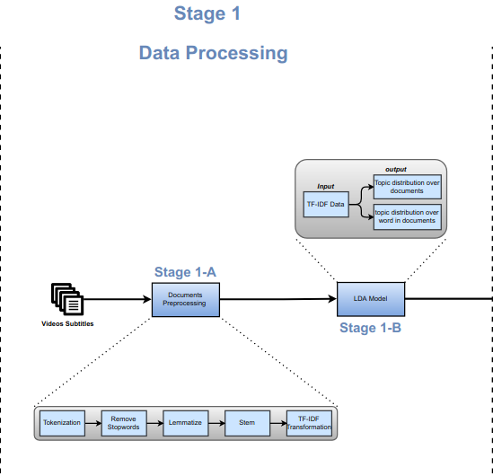

# Data-Processing-(Stage 1)

In this stage the aim was to extract the topics from the video subtitles in the dataset. So, we decided to use the [LDA model](https://en.wikipedia.org/wiki/Latent_Dirichlet_allocation) for topic modelling.

The first step was preprocesssing the text in the dataset and cleaning it. The cleaning process had many stages ( tokenization, removing the stopwords, lemmatization, stemming ). 

After cleaning the texts, we converted the tokens into tf-idf. 

In the last stage, we trained the LDA model on the processed texts. The model was trained on various number of topics that ranges between 1 and 300 and two language models. After training a big number of models we found out that 7 topics and uni-gram language model were the best with coherence score higher than 0.65.

