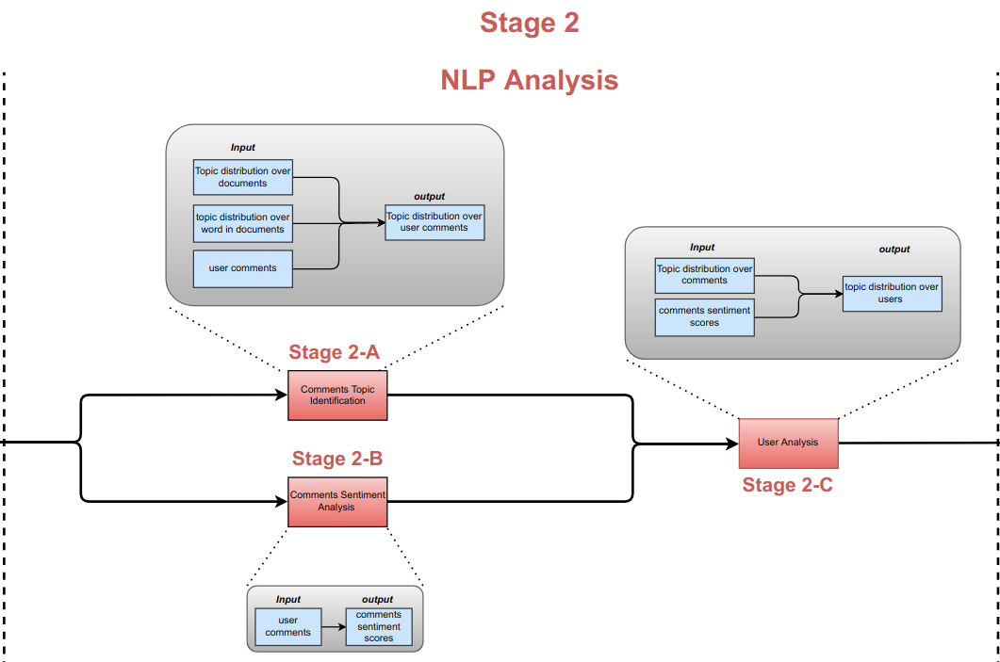

# NLP Analysis

In this stage, we need to compute topic distribution over users. Firstly, topic distribution over user comments will be calculated using topic distribution over subtitles, word in subtitles, and user comments. After that, comment sentiment analysis will be calculated using Stanford Core NLP. Then topic distribution over comments will merge with the comment's sentiment score to get the topic distribution over users 

