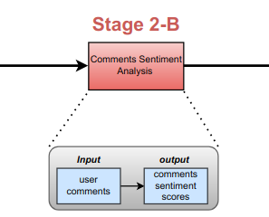

# Sentiment-Analysis

We chose two options to apply sentiment analysis on YouTube comments

The first option was TextBlob which is built on top of NLTK, and it’s more easily accessible. The other one is Stanford’s CoreNLP which is a Java library with Python wrappers. It’s in many existing production systems due to its speed.

The main differences between them illustrated in the below table

<table>
  <tr>
    <th>Library Type</th>
    <th>Positive</th>
    <th>Neutral</th>
    <th>Negative</th>
  </tr>
  <tr>
    <td>Textblob</td>
    <td>0.4</td>
    <td>0.4</td>
    <td>0.4</td>
  </tr>
  <tr>
    <td>Stanford Corenlp</td>
    <td>0.4</td>
    <td>0.4</td>
    <td>0.4</td>
  </tr>
</table>

